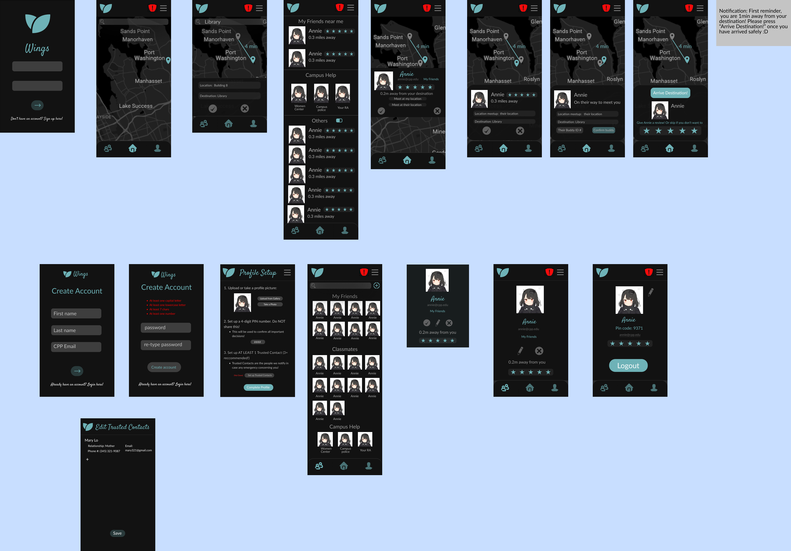

# Wings: With Wings, You Never Walk Alone

### Important Update (6/4/2021 2:45PM) - Database is down, app temporarily offline!

## Demo: Walkthrough (Updated 5/29/2021)

**Notes:    The map settings on the right is shown to display how to imitate a user's current location! 
<br>

## Table of Contents
1. [Overview](#Overview)
2. [Product Spec](#Product-Spec)
3. [Wireframes](#Wireframes)
4. [Schema](#Schema)

## Overview:
### Description
Due to the recent rise of hate-crimes, the risk of public danger has significantly escalated for the general population. In addition to this, with the slow integration of in-person activities during the pandemic, countless college campuses are preparing for a large percentage of in-person courses. With both the growth of potential harm and actual public population (especially that of college campuses), Wings inspired to help provide a safer commmunity in these uncertain times.

Wings is an Android application that connects users to others when they feel unsafe in their current conditions. 

Users who are connected are confirmed to be safe "walking buddies" for each other, and are intended to walk together to some common, agreed upon destination. However, Wings intends to offer multiple ways to provide trusted safety sources such as: immediate connection to the police, one button notifcation to emrgency contacts, routing to the nearest registered safe spaces. Several safety precautions are taken during this pairing of users. Wings constantly tracks both users and saves real time information in a real time database. Both users' emergency information are held and and may be contacted at any time, even without a pairing to another user. Users may also choose to leave their buddy at any time. 

### App Evaluation:
- **Category:** Safety
- **Mobile:** The app's function relies on the user's ability to move and be tracked. The app will utilize a user's location, display urgent notifications, and display relative map views. The programm cannot be used on immobile devices. 
- **Story:** With the recent rise of hate-crimes, the app was developed to promote safety and community unity. The app can be useful to several demographics and provides a safer aspect of travel for all users. Because of its potential universal use, the app may be well responded to and spread easily. 
- **Market:** The app is potentially marketable to all people who feel unsafe traveling by themself. However, the app will cater specifically to Cal Poly Pomona students for now. Later, the app may be expanded to work on several college campuses as well. 
- **Habit:** The app is very habitual and can be used daily if need be. Users may feel unsafe at any time of the day, and therefore the app can be handy in all such situations. Users only comsume the app, there is currently no plans to allow user creativity.  
- **Scope:** Wings will be pretty wide, as it will contain many safety feautures and location matching. There is a lot of room to expand to include various other features. Currently the stripped down version is still interesting to build but would not be very secure and safe to use. 

## Product Specifications:

### 1. User Stories (Required and Optional)

**Required Must-have Stories**
- [X] Database set up in back4app.
- [x] User can register a new account.
- [x] User can login.
- [x] User can log off.
- [x] User can view their own profiles.
- [x] User can view other profiles

- [x] User is shown all possible buddies.
- [x] User can send, receive, and respond to multiple Buddy Requests.
- [x] User can verify their Buddy when meeting in person. 
- [x] User can confirm when they've safely arrived at their destination. (button to comfirm)
- [x] User can input their intended destination on a map. 
- [x] Users are tracked while on a Buddy Trip.
- [x] User can search for other users.
- [ ] User can send Emergency Information quickly to Trusted Contacts.

**Optional Nice-to-have Stories**
- [ ] Different modes of buddying up:
   - [ ] User can choose to be "able to be a Buddy" when not in need of a Buddy themself. 
   - [ ] User can choose to be a Solo Walker, where they walk to their destination on their own but is still open to being paired with a Buddy. 
- [ ] User can add friends.
- [ ] User can view friend list.
- [ ] Buddies can rate each other after a Buddy Trip. 
- [ ] Users can chat with their Buddies. 
- [ ] User can request to chat with other users. 
- [ ] Buddying can be extended to groups.
- [ ] The user is shown best matched possible buddies first.
- [ ] Filters are available when a user searches through a list of possible buddies. 
- [ ] User can modify their profile information.
- [ ] User can modify their account and app settings. 
- [ ] Users can choose to receive notifications when there is a new possible buddy.
- [ ] Users are banned if their rating is too low. 
- [ ] Users are shown the nearest registered safe spaces.
- [ ] Users can report suspicious areas/activity.

### 2. Screen Archetypes
* Login
   * User can login
* Register
   * User can register a new account.
   * User can go back to login screen
* Create Profile 
   * User can customize their profile
* Profile
    * User can view their own information 
    * User can log out
* Map-View
    * User can input their destination to create a buddy request
    * Buddy Pairs are required to confirm a route on the map to follow. 
* Stream
    * User is shown all possible buddies
    * User can search for other users.


### 3. Navigation

**Tab Navigation** (Tab to Screen)
* Home Screen
* Buddy Request Screen
* Profile Screen
* Contact list Screen


**Flow Navigation** (Screen to Screen)
Login
   * Map-View 
   * Register
* Register
   * Map-View 
   * Login
* Profile
    * Map-View 
    * Stream 
* Map-View (Home Screen)
    * Stream
    * Profile
* Stream (Create buddy request Screen)
    * Profile
    * Map-View

## Wireframes:


### [BONUS] Digital Wireframes & Mockups
https://www.figma.com/file/FvkFBW65HVYdpSDwqsKRMM/Wings?node-id=0%3A1

### [BONUS] Interactive Prototype
https://www.figma.com/proto/FvkFBW65HVYdpSDwqsKRMM/Wings?node-id=4%3A8&scaling=scale-down&page-id=0%3A1

## Schema 

### Models
**User**
Property            |  Type  | Description
:-------------------------:|:-------------------------:|:-------------------------:
fname | String | user's first name
lname | String | user's last name
email | String | user's CPP email (MUST end in "@cpp.edu")
password | String | user's password
PIN | Number | user's private 4-digit number to confirm ALL significant decisions!
objectId | String | uniquely identifies this User in the Parse database
username | String | user's username in their CPP email (everything before the "@cpp.edu")
profileImage	| File	| the image to be displayed on the user's profile
trustedContacts | Array[TrustedContact] | user's trusted contacts to be notified in case of emergency, max size of 5
friends |	List of String (Array in Parse)| List of User objectId's that the user wants to keep in contact with 
currentLocation	| Geopoint	| the user's current location 
profileSetUp | boolean | whether or not the user's profile is set up
rating | Number | average rating

**TrustedContact**
Property            |  Type  | Description
:-------------------------:|:-------------------------:|:-------------------------:
user | Pointer | pointer to the User object who the Trusted Contact is associated with
fname | String | Trusted contact's first name
lname | String | Trusted contact's last name
relationship | String | Trusted contact's relationship to the user
phone | String | Trusted contact's mobile phone number
email | String | Trusted contact's email

**Buddy**
Property            |  Type  | Description
:-------------------------:|:-------------------------:|:-------------------------:
user| Pointer	| points to the User object who currently needs to get to there destination
meetingLocation	| Geopoint | where the Buddy will meet their partner 
receivedBuddyRequests | List of BuddyRequest (Array in Parse) | List of all received BuddyRequests, need to respond to
sentBuddyRequests | List of BuddyRequest (Array in Parse) | List of all sent BuddyRequests, waiting for a response
hasBuddy | boolean | whether or not the Buddy is already paired
onMeetingBuddy | boolean | whether or not the Buddy is currently meeting with their partner
onBuddyTrip | boolean | whether or not the Buddy is currently on a BuddyTrip
buddyTrip | Pointer | points to the BuddyTrip object the Buddy is currently on IF applicable, null otherwise
objectId	| String | uniquely identifies this User on this specific BuddyTrip, null if hasBuddy = false

**BuddyRequest**
Property            |  Type  | Description
:-------------------------:|:-------------------------:|:-------------------------:
objectId | String | uniquely identifies this BuddyRequest 
sender | Pointer	| points to the Buddy object who sent the BuddyRequest
receiver | Pointer | points to the Buddy who needs to respond to the BuddyRequest
isConfirmed | boolean | whether or not the BuddyRequest has been approved by both Buddies, otherwise, is waiting for a response
methodOfMeeting |	String | who's location the Buddies will meet at: "sender", "receiver", or "halfway"
meetingLocation| Geopoint	| the location where the buddies will head towards to meet
chosenTargetLocation | Geopoint | where the buddies are ultimately walking together for

**BuddyTrip**
Property            |  Type  | Description
:-------------------------:|:-------------------------:|:-------------------------:
objectId | String | uniquely identifies this BuddyTrip
buddyOne | Pointer | points to the one of the Buddy objects in question
buddyTwo | Pointer | points to the other Buddy object in question
targetDestination | Geopoint | where the buddies are ultimately walking together for 
senderLocation	| Geopoint | current location of the request sender
receiverLocation	| Geopoint | current location of the request receiver
EST	| Number | the calculated approximate time it will take for the pair to arrive at their targetDestination (minutes)
timeElasped	| Number| how long it has been since the BuddyTrip began (minutes)


### Networking
**List of network requests by screen**
- Login screen
   - (Read/GET) Request to login <br>
   ```ParseUser.logInInBackground(username, password, new LogInCallback() {;
            @Override
            public void done(ParseUser user, ParseException e) {
                if(user != null){
                    Log.d(DEBUG_TAG, "Login Success!!");
                    loginSuccess();
                }
      }
  
- Register #2 screen:
   - (Create/POST) Create new User<br>
   ```ParseUser user = new ParseUser();
      user.setEmail(email);
      user.setPassword(password);
      user.setUsername(username); 
 
- Profile Setup screen and Settings screen:
   - (Update/POST) User's email, username, password, or PIN<br>
   `Parse.getCurrentUser().setEmail(email);`
   `Parse.getCurrentUser().setUsername(username);`
   `Parse.getCurrentUser().setPIN(pin);`
  
- Home screen:
   - (Read/GET): BuddyTrip’s calculated EST <br>
     ```ParseQuery<BuddyTrip> query = ParseQuery.getQuery(BuddyTrip.class)
        query.whereEqualTo(BuddyTrip.KEY_USER, Parse.getCurrentUser())

- Edit Trusted Contacts Screen:
   - (Update/PUT) User’s attribute: Trusted Contacts list <br>
      `Parse.getCurrentUser().setTrustedContacts(list);`

- Search user screen:
   - (Read/GET) Query for a user given String username inputted <br>
   ```ParseQuery<User> query = ParseQuery.getQuery(User.class);
      query.whereEqualTo(User.KEY_USERNAME, input);
      
- Choose Buddy screen:
   - (Read/GET) All Buddies who’s current location is X distance away <br>
      ```ParseQuery<Buddy> query = ParseQuery.getQuery(Buddy.class);
         query.whereEqualTo(Buddy.KEY_CURRLOC, Parse.getCurrentUser().getLocation + X);
      
   - (Read/GET) All User’s who’s “Able to be a Buddy” is on <br>
      ```ParseQuery<Buddy> query = ParseQuery.getQuery(Buddy.class);
         query.whereEqualTo(Buddy.KEY_CANBUDDY, true;
        
